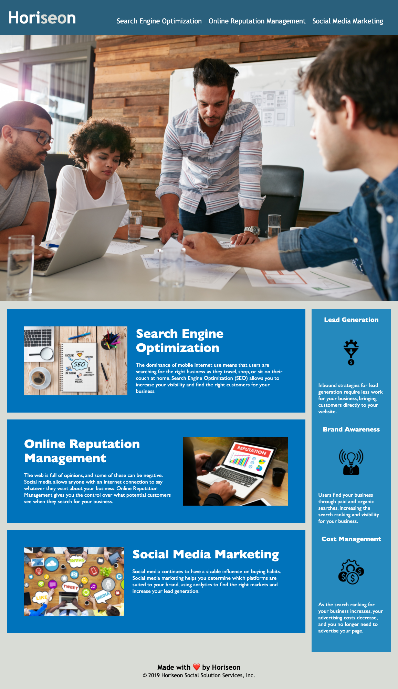

# psychic-rotary-phone

Assignment Summary: Refactoring

Company: Horiseon

App Link: [Refactoring](https://mmehr1988.github.io/psychic-rotary-phone/)

Refactoring: Code refactoring is defined as the process of restructuring computer code without changing or adding to its external behavior and functionality.

Goal: To make the website more accessible.

Accessibility: Web accessibility means that websites, tools, and technologies are designed and developed so that people with disabilities can use them.

- Accessibility & SEO: Accessible sites rank higher in search engines.
- Accessibility & Litigation: It also helps companies avoid litigation, which might arise if people with disabilities can't access a website.

For more information, check out [The Four Principles of Accessibility guide](https://willowtreeapps.com/ideas/the-four-principles-of-accessibility).

Scout Rule & Web Development: SEFCO :)

- Sustainable Code: Improve the codebase for long-term.
- Efficient Code: Making use of semantic HTML elements. Consolidating the selectors and properties where possible.
- Functional Code: All links are functioning correctly.
- Cleaner Code: Always try to leave the code a little cleaner than when you found it.
- Organized Code: Use comments before each element or section of the page to create make code easier to read.

# Refactoring Process

Upon opening up the assignment files in VSCode, the first thing I did was to open the html in the browser and review the website as a user. By doing so, I was able to understand who Horiseon was and what the website intentions were.

A digital marketing services agency that provides strategies in three main areas: Search Engine Optimization, Online Reputation Management, Social Media Marketing. For this reason, I understood the company wants users to focus on the three boxes below the large image.

In terms of functionality, the first link “Search Engine Optimization” was not working. This was something I was going to have to look into.

Once I felt I got a good understanding of the website, I decided to tackle the refactoring process.

## Missing Title

Updated the title of the document to Horiseon

## Use of Comments For Organizational Puproses

For the HTML file, I separated the code into 4 parts.

1. Header
2. Large Image
3. Main Section
   - Content – For the 3 content boxes describing what services Horiseon provides
   - Benefits – For the side benefits bar
4. Footer

For the CSS file, I separated the styling with the same descriptions used in the HTML file. I also noticed that some of the content section was under the benefits section which did not logically make sense.

## Use of Semantic HTML

The below is the list of semantic html elements used in this assignment vs. each section of the code to replace the `<divs>`.

1. Header
   - `<header>`
   - `<nav>` - For the navigation links
2. Large Image
   - `<figure>` - For the standalone image.
3. Main Section
   - `<main>`: To signify the main section of the webpage
   - `<section>`: To separate the content and benefits section
   - `<article>` & `<aside>`: When reviewing the webpage for the first time, the contents section was what I believe to be the attention grabber. The benefits section was secondary. Therefore, `<article>` was used for the content boxes and `<aside>` for the benefits side bar.
4. Footer
   a. `<footer>` - To specify the footer section of the webpage

## Removal of Unique Class Names

Since the styling for the content boxes and benefits side bar were all the same, I removed the individual unique class names. This provided the opportunity to clean up the styling page by using one class name for each section.

## Missing Alt Descriptions

All img elements in the html file were missing alt descriptions. For accessibility purposes, I gave all images their own descriptions.

## Broken Navigation Link

When testing out the code in the browser, I noticed the "Search Engine Optimization" nav link was not working. I was able to fix this by including an “id=search-engine-optimization” in `<article>` .

## Font-Size & Color & Font-Family

- Font-Size: In CSS, I changed the way the styling for font-size was being utilized. I placed the font size of 16px under the basic setup as the base font size for the webpage. I then updated all references to font-size to use % in relation to the 16px.

- Color: The theme of the webpage was to show text color in white color. For this reason, I also placed the ‘color: #ffffff’ under the basic setup.

- Font-Family: It’s typically a good idea to follow a consistent font-family across a webpage. For this reason, I placed the ‘Gills Sans’ in the basic setup section as well.

## Flexbox For Building Navigation Bar

I noticed the nav header would continuously break onto a new line. To prevent this issue, I was able to put together the process of building a versatile header through use of Flexbox. All thanks to our bootcamp.

## Heart Symbol vs. HTML Code `&#10084;&#65039`

I noticed a weird heart symbol was used in the footer. Out of curiosity, I researched and came across HTML having specific syntax for these situations. Decided it would be better to add using html code since I'm not 100% sure the original symbol will translate correctly across all platforms.

## Final Image

The following image demonstrates the final output of my refactoring work.

